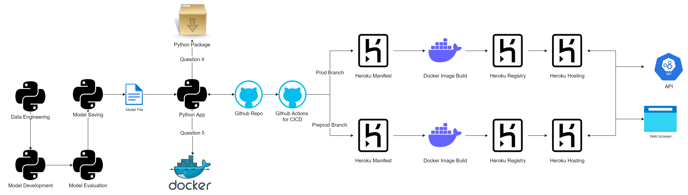

## Question 1
### Please provide a high level overview of your systems design and its key components.
This could be a one pager, a readme.md or an architecture diagram. We will leave the implementation up to you.

## Solution
### High Level Overview

### General Design
1. Python does Model process.
2. Model is saved to file.
3. Python loads saved model.
4. Python code is packaged and also dockerised in relevant questions.
5. Github is used for Devops and version control, including CICD process.
6. Heroku has a preprod and prod application environment and included in the CICD process
7. Users can interact with the public url via web browser or API platforms such as Postman.